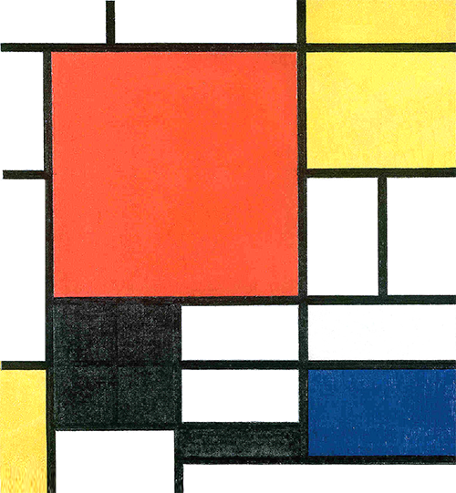
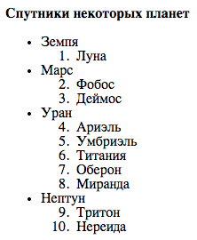
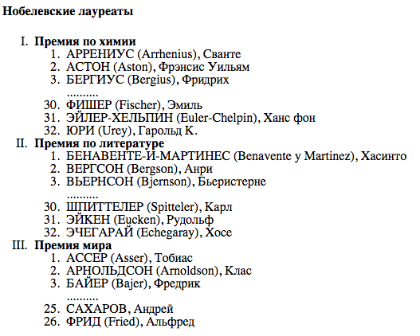

# Домашнее задание. Верстка. Урок 2.

Справочник по тегам и аттрибутам тегов: [htmlbook.ru](http://htmlbook.ru/html)

## Задание 1
### Семантические теги 
Создать файл task1.html.
Самостоятельно изучить (и попробовать в коде) следующие семантические теги.

Обозначить ошибку в тексте можно тегом *del* (по умолчанию он будет перечеркнут), а вставленный текст — тегом *ins* (обозначается подчеркиванием). Несмотря на то, что это строчные теги (не разрывают строки), внутри них допускается размещение блочных элементов.

    <del>
Неверная информация
</del>
    <ins>
Новая информация
</ins>

Есть также:

    <dfn>термин, впервые определяемый в документе</dfn>
    <code>программный код или его фрагмент</code>
    <samp>результат вывода компьютерной программы или скрипта</samp>
    <kbd>название клавиш или набираемого на клавиатуре текста</kbd>
    <var>переменная (математическая или компьютерной программы)</var>
    <cite>цитата или сноска на другой материал</cite>

Контактную информацию предлагается размещать в блочном элементе *address*, содержимое которого также отображается наклонным начертанием.

Короткие цитаты можно выделить строчным тегом *q* (текст отобразится в двойных кавычках). Для длинных предназначен блочный элемент *blockquote*, который отображается с некоторым отступом со всех сторон. 
У тегов *q* и *blockquote* есть необязательный атрибут cite, значением которого обычно указывают ссылку (URL) на цитируемый источник. Большинство браузеров этот атрибут игнорируют, однако поисковые системы могут учитывать его при анализе страницы.

Для аббревиатур и акронимов предназначен тег *abbr*. Обычно его снабжают всплывающей подсказкой с помощью глобального атрибута title, в котором указывают расшифрованное значение.

Тег *mark* предназначен для выделения фрагментов текста в контексте действий пользователя, даже если они не выделяются в оригинале. Например, им можно обозначать слова, соответствующие поисковому запросу или ошибки во вводимых пользователем данных. 
Оформление содержимого элементов <mark> определяется в таблицах стилей.

## Задание 2
### Таблицы
В файле task2.html необходимо сверстать картину Пита Мондриана "Композиция с красным, синим и желтым" используя таблицу.
Смотри файл tables_hw.png

 
Привожу цвета используемые в картине:

\#fffa69 - желтый,
\#074481 - синий,
\#ff5b2d - красный,
\#000000 - черный,
\#ffffff - белый

Пропорции картины и ячеек можно не сохранять. Важно объединение ячеек и их раскраска.

В *head* следующий кусок кода

    
    
А разукрасить ячейку определенным цветом можно аттрибутом bgcolor

    <td bgcolor="#00000ff"> </td>

## Задание 3
### Формы
В файле task3.html необходимо сверстать форму как на изображении forms_hw.png

Для переносов строк использовать тег *br*.

Количество вариантов в поле год и месяц можно делать 3-4 (не обязательно перечислять все).

Названия полей (name="") - на ваше усмотрение.

## Задание 4
### Списки
Создать файл task4.html.

**Часть 1**

Вверху страницы создать используя списки меню со ссылками на файлы task(1|2|3). Текст ссылок - название задания.

**Часть 2**

Далее сверстать список по макету из файла lists1_hw.png.

*Текст для задания*

Спутники некоторых планет

Земля
Луна
Mapc
Фобос
Деймос
Уран
Ариэль
Умбриэль
Титания
Оберон
Миранда
Нептун
Тритон
Нереида

**Часть 3**

Далее сверстать список по макету из файла lists2_hw.png.

*Текст для задания*

Hoбeлeвcкиe лауреаты
Премия по химии
АРРЕНИУС (Arrhenius), Сванте
ACTOH (Aston), Фрэнсис Уильям
БЕРГИУС (Bergius), Фридрих 
..........
ФИШЕР (Fischer), Эмиль
ЭЙЛЕР-ХЕЛЬПИН (Euler-Chelpin), Ханс фон
ЮРИ (Urey), Гарольд К.
Премия по литературе
БЕНАВЕНТЕ-И-МАРТИНЕС (Benavente у Martinez), Хасинто
BEPГCOH (Bergson), Анри
BЬEPHCOH (Bjernson), Бьеристерне 
..........
ШПИTTEЛEP (Spitteler), Карл
ЭЙKEH (Eucken), Рудольф
ЭЧЕГАРАЙ (Echegaray), Xoce
Премия мира
ACCEP (Asser), Тобиас
APHOЛЬДCOH (Arnoldson), Клас
БAЙEP (Bajer), Фредрик 
..........
САХАРОВ, Андрей
ФPИД (Fried), Альфред
